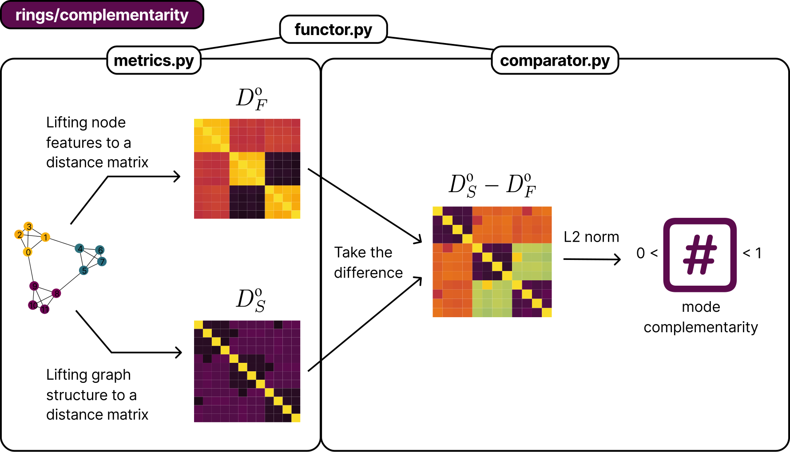
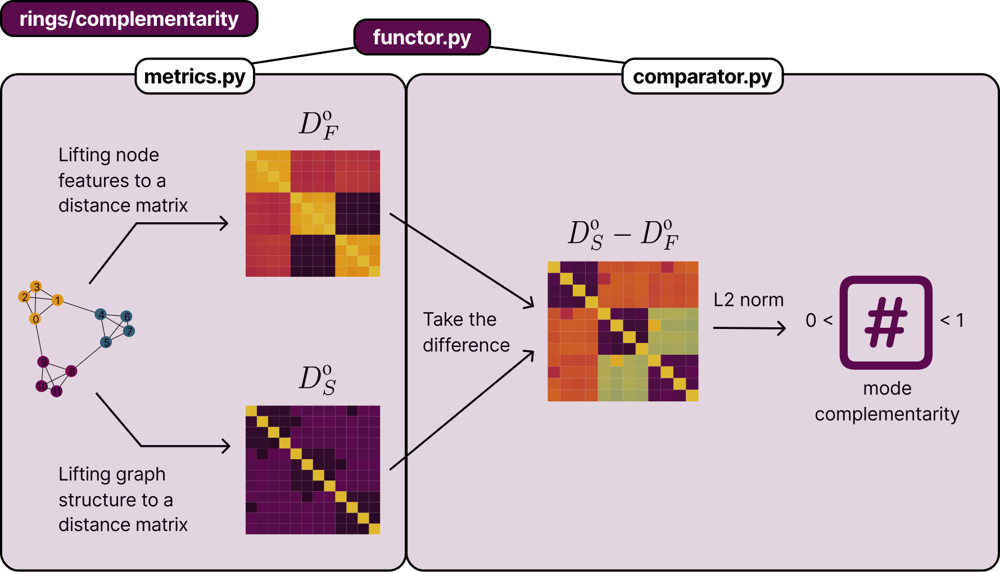
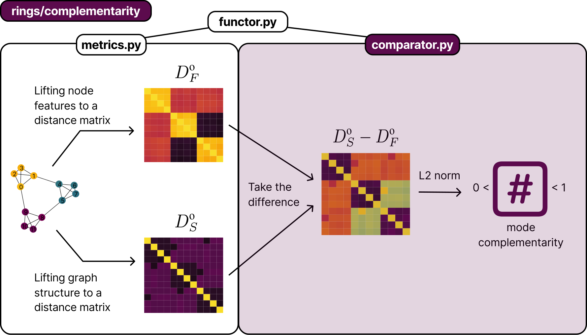
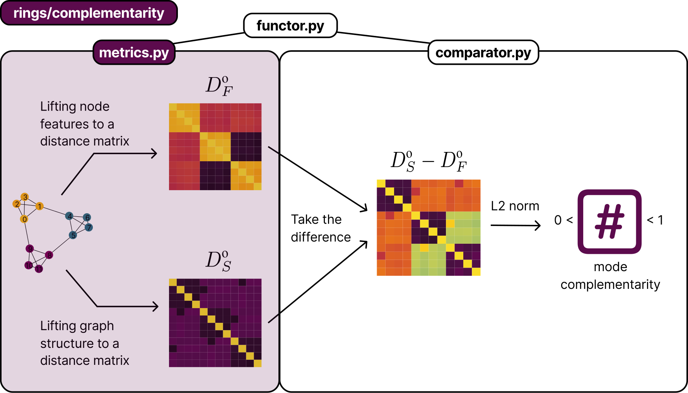

🔑 Mode Complementarity
========================

The ``rings.complementarity`` module measures the alignment between node features and graph structure by comparing their induced metric spaces. It pairs **graph metrics** (diffusion, heat-kernel, resistance, shortest-path) with **matrix-norm comparators** and a **functor** that handles disconnected graphs component-wise.

|

|

Functor
-------

|

.. automodule:: rings.complementarity.functor
   :members:

Comparators
-----------

|

.. automodule:: rings.complementarity.comparator
   :members:

Metrics
-------

|

.. automodule:: rings.complementarity.metrics
   :members:

Utilities
---------

.. automodule:: rings.complementarity.utils
   :members:
