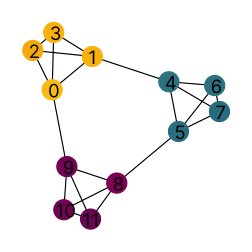

RINGS: Relevant Information in Node Features and Graph Structure
==================================================================

Official implementation of the ICML 2025 paper `No Metric to Rule Them All: Toward Principled Evaluations of Graph-Learning Datasets <https://doi.org/10.48550/arXiv.2502.02379>`__. RINGS is a perturbation framework for attributed graphs that lets you evaluate graph-learning datasets and models from first principles: apply structured perturbations, train as usual, and compare performance distributions with statistically rigorous tests. Source on `GitHub <https://github.com/aidos-lab/rings>`__.

|

Install
-------

.. code-block:: bash

   pip install rings-evaluation

Requires Python 3.11+. Package on `PyPI <https://pypi.org/project/rings-evaluation/>`__.

From source
~~~~~~~~~~~

To contribute or run the examples in this repo:

.. code-block:: bash

   pip install uv
   git clone https://github.com/aidos-lab/rings.git && cd rings
   uv sync && source .venv/bin/activate

Quickstart
----------------------------------------------

.. note::
     RINGS can be integrated into your GNN training pipeline.

Keep your training loop. Wrap it with ``SeparabilityStudy`` to iterate perturbation × seed, record one scalar per run from *your* evaluator, and get a pairwise separability table back.

.. code-block:: python

   from rings import Original, EmptyGraph, RandomFeatures, CompleteFeatures
   from rings.integrations import SeparabilityStudy

   study = SeparabilityStudy(
       perturbations={
           "Original":         Original(),
           "EmptyGraph":       EmptyGraph(),
           "RandomFeatures":   RandomFeatures(shuffle=True),
           "CompleteFeatures": CompleteFeatures(max_nodes=max_nodes),
       },
       num_seeds=5,
       comparator="ks",   # or "wilcoxon"
       alpha=0.05,
   )

   for name, transform, seed in study.runs():
       perturbed = study.apply(base_dataset, transform)
       score = train_and_eval(perturbed, seed=seed)   # your code
       study.record(name, score)

   results = study.evaluate(n_permutations=1000)
   # DataFrame: mode1, mode2, score, pvalue_adjusted, significant

**PyTorch Lightning** — attach ``SeparabilityCallback`` to your ``Trainer`` and it records the logged ``test_acc`` automatically:

.. code-block:: python

   import pytorch_lightning as pl
   from rings.integrations import SeparabilityStudy, SeparabilityCallback

   for name, transform, seed in study.runs():
       pl.seed_everything(seed, workers=True)
       dm = make_datamodule(study.apply(base_dataset, transform), seed=seed)
       trainer = pl.Trainer(
           max_epochs=20,
           callbacks=[SeparabilityCallback(study, perturbation_name=name)],
       )
       trainer.fit(model, datamodule=dm)
       trainer.test(model, datamodule=dm)

   results = study.evaluate()

**Custom evaluator** (GraphBench, OGB, anything that returns a scalar): just pass the number to ``study.record(name, score)``.

Runnable examples::

   uv run -m examples.integrations.pyg
   uv run --with lightning -m examples.integrations.lightning
   uv run --with graphbench-lib -m examples.integrations.graphbench

|

Reference
---------

.. toctree::
   :maxdepth: 1
   :caption: 🔌 Quickstart

   integrations

.. toctree::
   :maxdepth: 1
   :caption: 📖 Core Concepts

   perturbations
   separability
   complementarity

.. toctree::
   :maxdepth: 1
   :caption: 🛠 Utilities

   utils

Citation
--------

.. code-block:: bibtex

   @inproceedings{coupette2025metric,
     title     = {No Metric to Rule Them All: Toward Principled Evaluations of Graph-Learning Datasets},
     author    = {Corinna Coupette and Jeremy Wayland and Emily Simons and Bastian Rieck},
     booktitle = {Forty-second International Conference on Machine Learning},
     year      = {2025},
     url       = {https://openreview.net/forum?id=XbmBNwrfG5}
   }

|

|
| **Interested in more of our work?** See `AIDOS Lab <https://aidos.group>`_ or our `GitHub <https://github.com/aidos-lab>`_.
