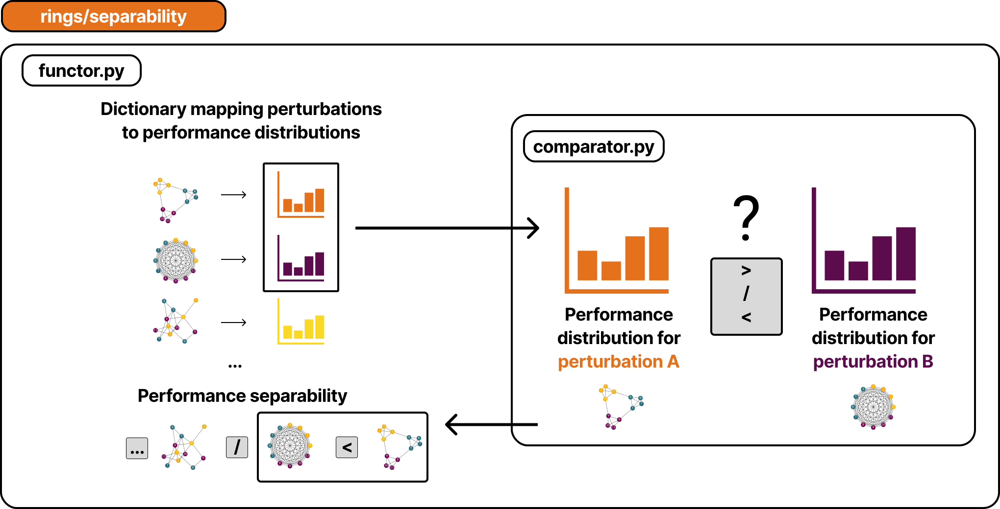
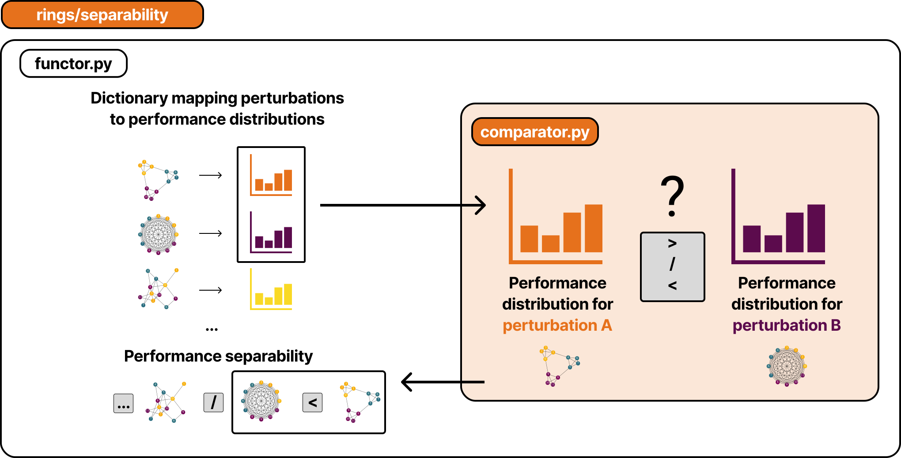
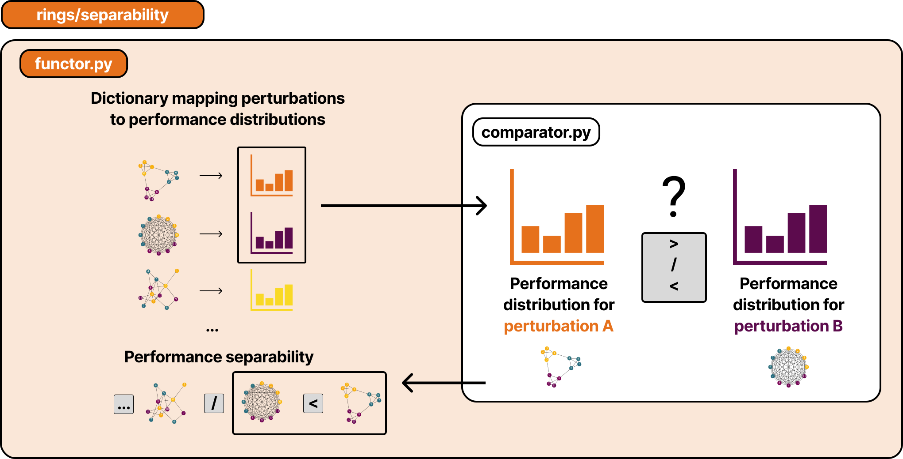

🔑 Performance Separability
============================

The ``rings.separability`` module tests whether performance distributions from different perturbations are statistically distinguishable. It pairs a **comparator** (the statistical test) with a **functor** (the orchestration: pairwise comparison, permutation testing, Bonferroni correction).

|

|

Comparators
-----------

|

.. automodule:: rings.separability.comparator
   :members:

Functor
-------

|

.. automodule:: rings.separability.functor
   :members:
